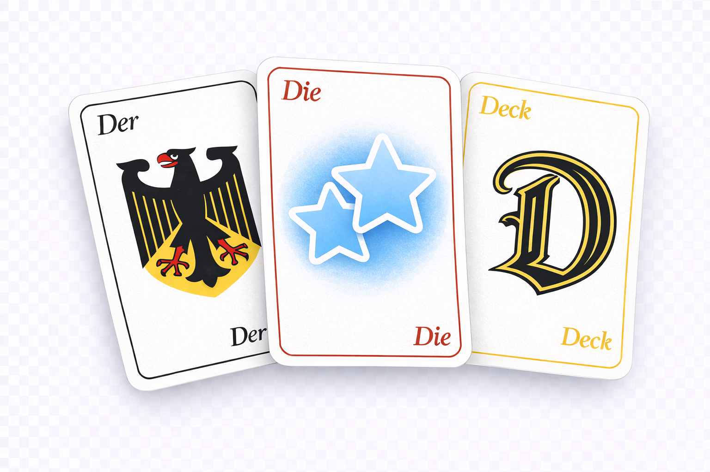

# DerDieDeck

DerDieDeck creates German Anki cards from clips, selected text, words, and grammar prompts.



DerDieDeck started as a clip-first workflow, but it now covers four distinct study paths:
- turn bookmarked YouTube clips into audio-first sentence cards
- process selected text from any webpage
- build Fluent Forever-style noun, adjective, and verb cards
- generate grammar cloze cards for inflection-heavy patterns

## Main Workflows

### Clip workflow
- mark YouTube timestamps with the bookmarklet
- copy them to the clipboard
- download the audio, transcribe it, clean up the German, add IPA and Russian, then create cards in Anki

### Text workflow
- send selected text from a webpage with the text bookmarklet, or type phrases manually in the terminal
- generate sentence cards without going through the YouTube clip pipeline

### Lexical workflow
- use one command, `words`, for nouns, adjectives, and verbs
- pass one item for immediate processing, or start it with no argument for mixed interactive batches
- route each item to the right workflow internally

### Grammar workflow
- create true Anki `Cloze` notes for grammar families
- currently focused on possessive determiners like `mein`, `dein`, `sein`, `unser`, and `euer`

## What The App Generates

### Sentence cards
- audio-first comprehension cards
- optional dialogue, production, pattern, and cloze cards from the same sentence when the analysis supports them

### Lexical cards
- picture-word noun cards with article-aware audio
- picture-word adjective cards when the adjective is clearly imageable
- sentence-based adjective cards when a single image is not enough
- picture-word or sentence-based verb cards, plus optional dictionary-form cards when the encountered form is non-obvious

### Grammar cards
- cloze notes built from grammatical slots rather than isolated tables

## Card Format

| Card Type | Front | Back |
|-----------|-------|------|
| Comprehension | `[audio]` + optional context | German + IPA + Russian |
| Dialogue | `[audio]` + reply task block | German reply, optional Russian hint |
| Production | Russian prompt + speaking task block | German + IPA + `[audio]` |
| Pattern | Pattern label + base example | Multiple example sentences + Russian gloss |
| Cloze | German sentence with blank + Russian + optional hint | Answer + full German sentence |

The default sentence card is the audio-first comprehension card.

## Requirements

### Always required

- Node.js
- Anki desktop
- AnkiConnect add-on

Install AnkiConnect:
1. Open Anki
2. Go to `Tools -> Add-ons -> Get Add-ons...`
3. Enter `2055492159`
4. Restart Anki

### Required for clip mode

```bash
brew install yt-dlp ffmpeg whisper-cpp
```

Download the Whisper model once:

```bash
curl -L -o /opt/homebrew/share/whisper-cpp/ggml-base.bin \
  https://huggingface.co/ggerganov/whisper.cpp/resolve/main/ggml-base.bin
```

If you only use lexical or grammar workflows, you do not need the YouTube/Whisper toolchain.

## Setup

```bash
git clone https://github.com/deemsk/yt2anki.git derdiedeck
cd derdiedeck
npm install

npm run init
open ~/.derdiedeck.json

npm run check
```

## Quick Start

### From YouTube clips

```bash
npm run bookmarklet
npm start
```

How it works:
1. Open a YouTube video in Safari
2. Use the bookmarklet to mark clips
3. Copy the clip list to the clipboard
4. Run `npm start` or `npm run clip`

### From selected text

```bash
npm run bookmarklet:text
npm start
```

How it works:
1. Select German text on any webpage
2. Run the text bookmarklet
3. Run `npm start`

### From typed text in the terminal

```bash
npm run text
```

Enter one German phrase per line.

### From words

```bash
npm run words -- "das Wasser"
npm run words -- "laufen"
npm run words
```

- one argument: process a single lexical item immediately
- no arguments: enter mixed interactive mode for nouns, adjectives, and verbs

Useful overrides for single items:

```bash
npm run words -- "wichtig" --meaning "важный"
npm run words -- "laufen" --sentence "Ich laufe jeden Morgen."
```

### From grammar prompts

```bash
npm run grammar -- possessive mein
```

## Lexical Notes

The lexical workflow is built around actual card types, not just dictionary lookups.

- nouns use the `2. Picture Words` note type for picture cards
- noun audio includes the article, for example `der Arzt`
- noun back sides can include plural and a short example sentence
- imageable adjectives stay in picture-word mode
- non-visual but useful adjectives move into sentence cards instead of being skipped
- verbs are routed into picture-word or sentence mode depending on how learnable they are from a single image

If `braveApiKey` is configured, Brave image search is tried first, with Openverse and Wikimedia as fallbacks.

During sentence previews, use `[R]eview` to tell AI what looks wrong and let it regenerate the draft.

## Commands

| Command | Description |
|---------|-------------|
| `npm start` | Process clipboard data from the bookmarklets |
| `npm run clip` | Process clips from clipboard explicitly |
| `npm run text` | Enter phrases manually in the terminal |
| `npm run words -- <item>` | Create one lexical note for a noun, adjective, or verb |
| `npm run words` | Create lexical notes interactively from mixed input |
| `npm run grammar -- <family> <lemma>` | Create grammar cloze notes |
| `npm run add -- <url> -s 0:10 -e 0:15` | Add one clip manually from YouTube |
| `npm run process -- <file.json>` | Process a saved markers JSON file |
| `npm run check` | Check local tools, API key, and AnkiConnect |
| `npm run test:integration` | Run end-to-end integration checks |
| `npm test` | Run Jest tests |
| `npm run config` | Show the resolved configuration |
| `npm run init` | Create the config file |
| `npm run bookmarklet` | Build and copy the YouTube bookmarklet |
| `npm run bookmarklet:text` | Build and copy the text-selection bookmarklet |

## Bookmarklet Keys

| Key | Action |
|-----|--------|
| `M` | Mark clip start/end |
| `E` | Copy clips to clipboard |
| `H` | Hide/show panel |

## Configuration

DerDieDeck prefers `~/.derdiedeck.json` and still reads `~/.yt2anki.json` as a legacy fallback.

Edit `~/.derdiedeck.json`:

```json
{
  "openaiApiKey": "sk-...",
  "ankiDeck": "German::YouTube",
  "ankiNoteType": "Basic (optional reversed card)",
  "wordNoteType": "2. Picture Words",
  "grammarNoteType": "Cloze",
  "openaiModel": "gpt-4o-mini",
  "googleTtsKeyFile": "",
  "googleApiKey": "",
  "googleTtsVoices": ["de-DE-Neural2-B", "de-DE-Neural2-C"],
  "braveApiKey": "",
  "whisperModel": "base",
  "ttsSpeed": 0.75,
  "ttsNormalRate": 0.9,
  "ttsPause": 1.0,
  "audioLeadIn": 0.4,
  "wordImagePreviewCount": 12,
  "wordImageSearchResults": 12,
  "dataDir": "/tmp/derdiedeck"
}
```

Notes:
- `ankiDeck` still defaults to `German::YouTube` for backward compatibility; you can rename it to something broader.
- `ttsSpeed` is the main rate used for generated word and sentence audio.
- `ttsPause` is a legacy setting from the old repeated sentence-audio flow and is no longer used in the default word/verb paths.
- `wordNoteType` is used for picture-word cards.
- `grammarNoteType` should point to an Anki cloze model with `Text` and `Back Extra` or `Extra`.

## Stack

- `yt-dlp` for YouTube audio download
- `ffmpeg` for audio cutting
- `whisper.cpp` for local speech-to-text
- OpenAI API for enrichment, routing, translation, IPA, and review
- Google Cloud TTS for generated audio
- AnkiConnect for note creation

## License

MIT
